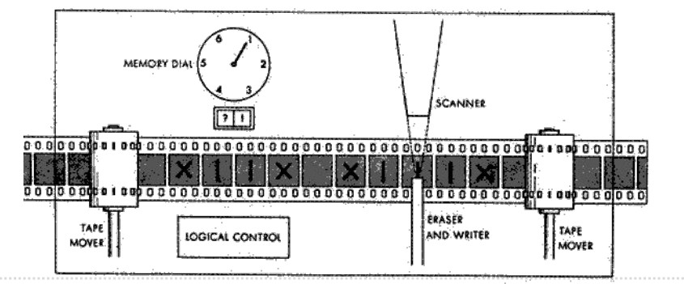
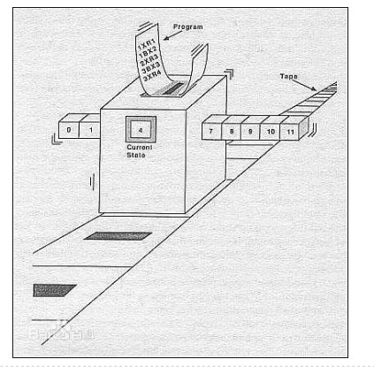

# 图灵机计算模型

## 基本思想

- 用机器模拟人用纸和笔进行数学运算的过程
- 比数值计算更为简单

---

## 基本概念

- 在纸上**写上**或**擦除**某个**符号**
- 把**注意力**从纸的一个位置转向另一个位置
- 在每个阶段，要决定下一步动作依赖于：
  1. 此人当前所关注的纸上某个位置的符号
  2. 此人当前思维的状态

  

---

## 基本组成

- 一条无限长的分格纸带，每格可以记录一个符号
- 一个读写头，可在纸带上左右移动，能读出和擦写格子的字符
- 一个状态寄存器，记录有限状态中的一个状态
- 一系列有限的控制规则：
  - 某个状态，读入某个字符时
  - 要改成什么字符
  - 要如何移动读写头
  - 要改变成什么状态

  

