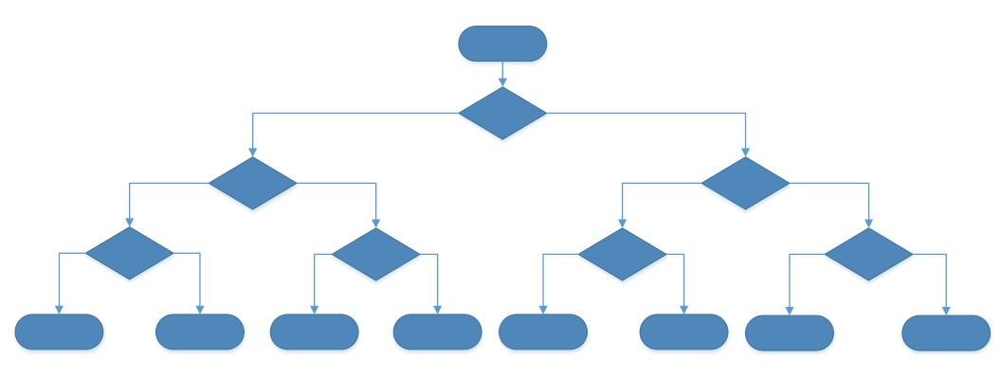
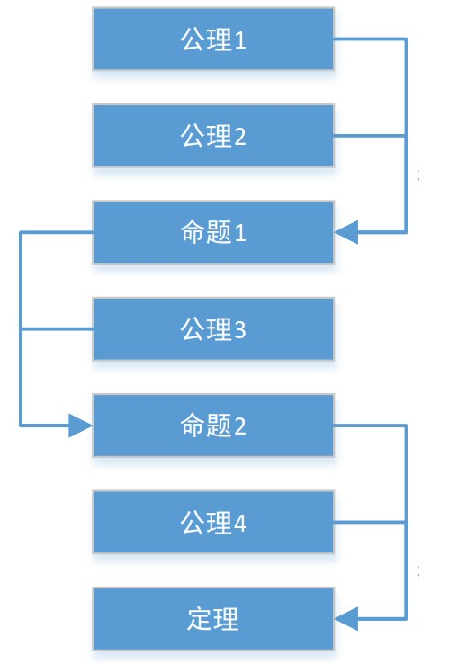
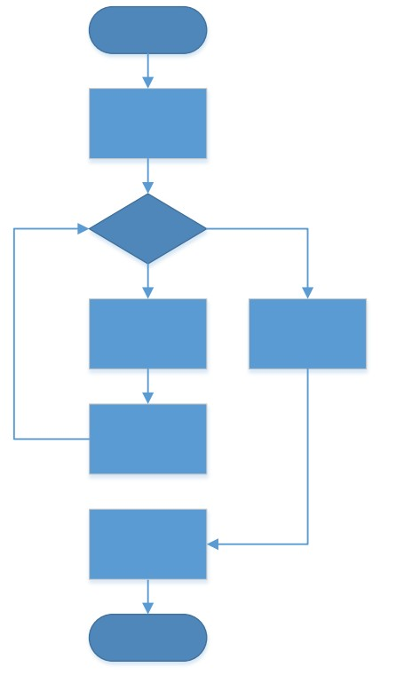
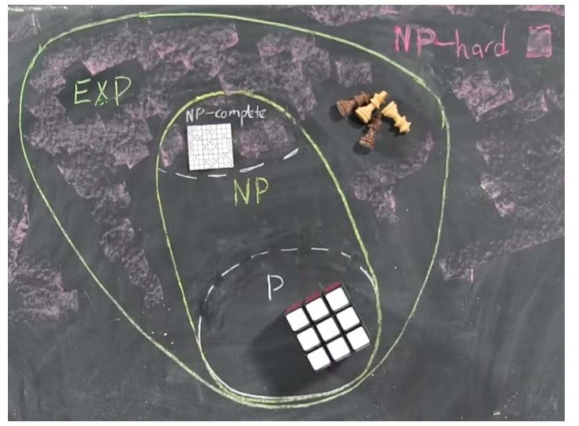

# 算法和计算复杂性

## 问题的分类

- What —— 面向判断与分类的问题
- Why —— 面向求因与证明的问题
- How —— 面向过程与构建的问题

---

## “可计算”的问题

用任何一个”有限能行方法“下的计算模型可以解决的问题，都是“可计算”的

- What：分类问题
  - 可以通过树状的判定分支解决
  
  

- Why：证明问题
  - 可以通过有限的公式序列来解决
  - 数学的定理证明从不自明的公理出发，一步步推理得出最后待证明的定理
  - 我们在以往学习过的定理证明即为此类解决方法
  
  

- How：过程问题
  - 可以通过算法流程来解决
  - 解决问题的流程：**算法**和**相应数据结构**的研究

  

---

## 计算的复杂性

- 基于**有穷观点的能行方法**的**可计算**概念
  - 仅仅涉及到问题的解决**是否**能在**有限**资源（时间/空间）内完成
  - 并不关心具体要花费**多少计算步骤**或**多少存储空间**

- 由于资源相当有限，对于问题的解决需要考虑其**可行性**如何
- 对问题的难易程度进行**分类**，是计算复杂性理论的研究范围

  

- 对于同一个问题，也会有不同的解决方法，其解决效率也是千差万别
- 计算复杂性理论研究问题的本质，将各种问题按照其难易程度**分类**，研究各类问题的难度**级别**，并不关心解决问题的具体方案
- 而算法则研究问题在不同现实**资源约束**情况下的不同解决方案，致力于找到**效率最高**的方案
  - 不同硬件配置（手持设备、PC设备、超级计算机）
  - 不同运行环境（单机、多机环境、网络环境、小内存）
  - 不同应用领域（消费、工业控制、医疗系统、航天领域）
  - 不同使用状况（正常状况、省电状况）

---

## 不可计算问题

不可计算问题就是定义清晰，但无法解决的问题。

在“基于有穷观点的能行方法”的条件下，已被证明并**不存在**解决方案

- 停机问题：判定任何一个程序在任何一个输入情况下是否能够停机
- 不可计算数：几乎所有的无理数，都无法通过算法来确定其任意一位是什么数字

