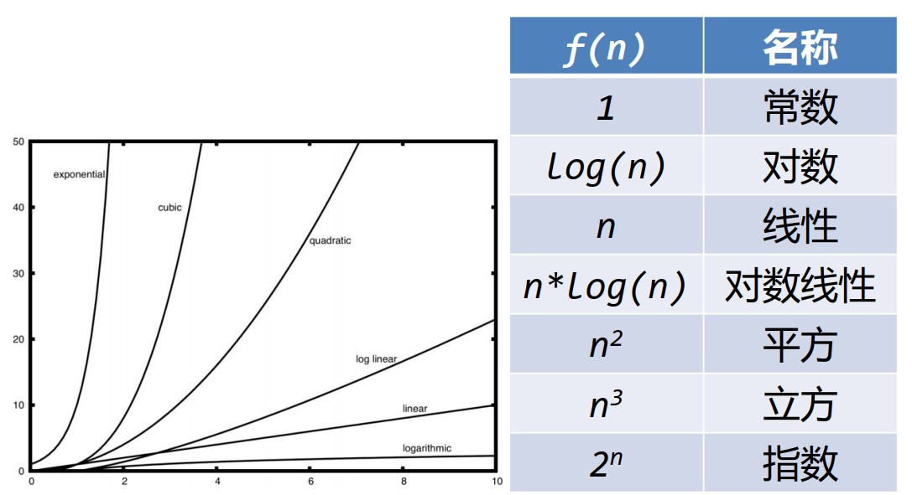

# 大 O 表示法

## 算法时间度量指标

- 一个算法所实施的操作数量或步骤数可作为独立于具体程序/机器的度量指标
- **赋值语句**是一个合适的选择
  1. 一条赋值语句同时包含了**表达式计算**和**变量存储**两个基本资源
  2. 除了与计算资源无关的定义语句外，主要就是三种控制流语句和赋值语句，而控制流仅仅起了组织语句的作用，并不实施处理

---

## 问题规模影响算法执行时间

- 问题规模是影响算法执行时间的主要因素
- 在前n个整数累计求和的算法中，需要累计的整数个数合适作为问题规模的指标
- 算法分析的目标是要找出**问题规模**会怎么影响一个算法的**执行时间**

---

## 数量级函数 Order of Magnitude

- 基本操作数量函数T(n)的精确值并不是特别重要，重要的是T(n)中起决定性因素的**主导部分**
- 数量级函数描述了T(n)中随着n增加而**增加速度最快**的主导部分

---

## 影响算法运行时间的其它因素

- 有时决定运行时间的不仅是问题规模
- 某些具体数据也会影响算法运行时间
  1. 分为最好、最差和平均情况，平均状况体现了算法的主流性能
  2. 对算法的分析要看主流，而不被某几种特定的运行状况所迷惑

---

## 大 O 数量级函数

- 通常当n较小时，难以确定其数量级
- 当n增长到较大时，容易看出其主要变化量级

  

---

## 其它算法复杂度表示法

- 大 O 表示法
  1. 表示了所有上限中最小的那个上限
- 大 Ω 表示法
  1. 表示了所有下限中最大的那个下限
- 大 θ 表示法
  1. 如果上下限相同，那么就可以用大 θ 表示

