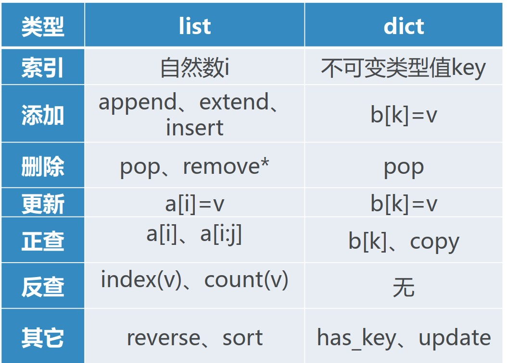
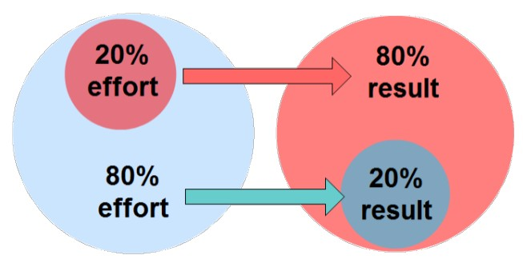
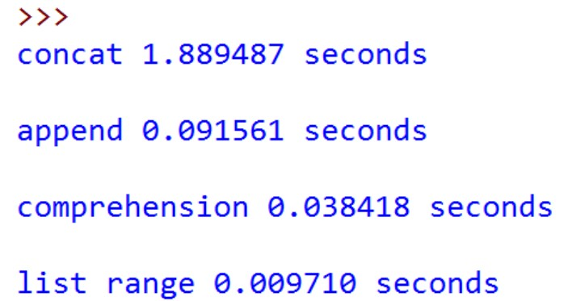
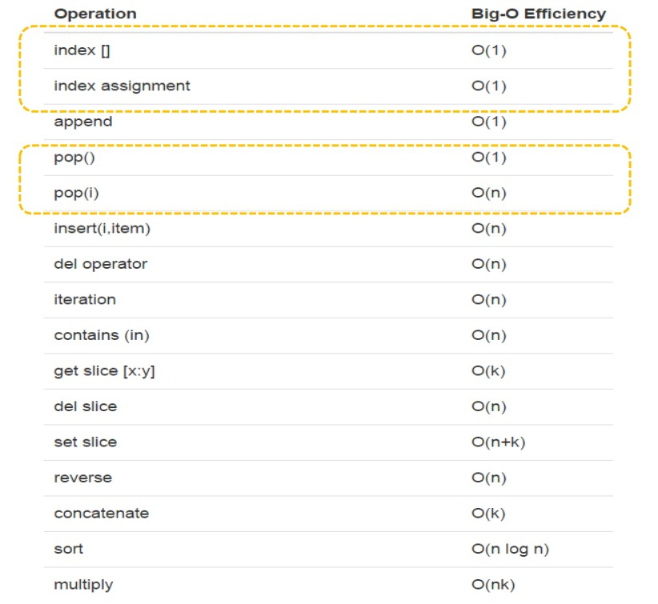
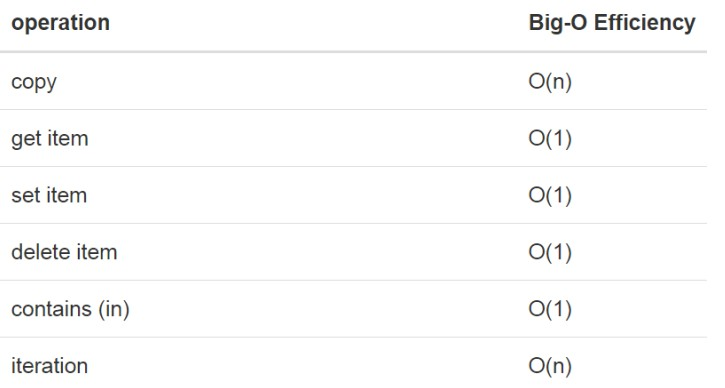
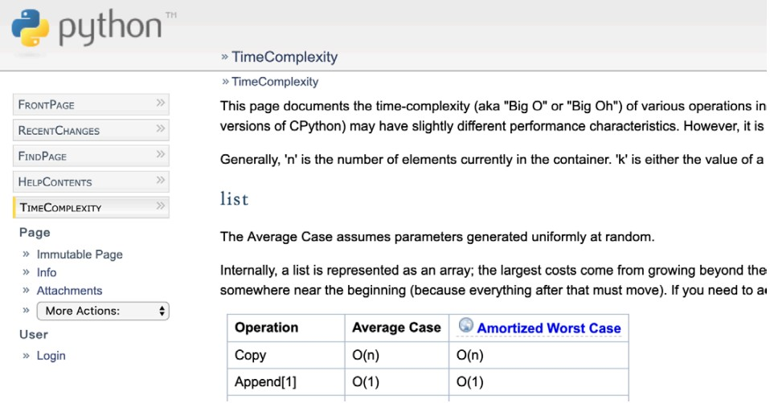

# Python 数据类型的性能

## Python 常用数据类型

列表 List 和字典 Dict，这是两种重要的 Python 数据类型



---

## List 列表数据类型

list 类型各种操作（interface）的实现方法有很多，如何选择具体哪种实现方法？

总的方案就是，让最常用的操作性能最好，牺牲不太常用的操作

  - > 80/20准则： 80%的功能其使用率只有20%

    

### 常用操作性能

- 最常用的是按索引取值和赋值`v= a[i], a[i]= v`，这两个操作执行时间与列表大小无关，均为O(1)
- 另一个是列表增长，可以选择`append()`和`__add__() → +`
  1. `lst.append(v)`，执行时间是 O(1)
  2. `lst= lst+ [v]`，执行时间是 O(n+k)，其中 k 是被加的列表长度

### 4种生成列表的方法

- 首先是循环连接列表（+）方式生成
  ```python
  def test1():
    l = []
    for i in range(1000):
        l = l + [i]
  ```
  
- 然后是用 append 方法添加元素生成
  ```python
  def test2():
    l = []
    for i in range(1000):
        l.append(i)
  ```
  
- 接着用列表推导式来做
  ```python
  def test3():
    l = [i for i in range(1000)]
  ```
  
- 最后是 range 函数调用转成列表
  ```python
  def test4():
    l = list(range(1000))
  ```

### 4种生成列表的方法计时

- 4种方法运行时间差别很大
  1. 列表连接（concat）最慢， List range 最快，速度相差近200倍。
  2. append 也要比 concat 快得多
  3. 另外，我们注意到列表推导式速度是 append 两倍的样子

  

### List 基本操作的大O数量级



---

## Dict 字典数据类型

- 字典与列表不同，根据关键码（key）找到数据项，而列表是根据位置（index）
  1. 最常用的取值get和赋值set，其性能为O(1)
  2. 另一个重要操作contains(in)是判断字典中是否存在某个关键码（key），这个性能也是O(1)



---

## 更多 Python 数据类型操作复杂度

Python 官方的算法复杂度网站：
[https://wiki.python.org/moin/TimeComplexity](https://wiki.python.org/moin/TimeComplexity)



