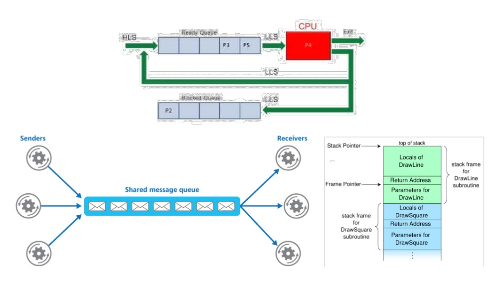

# 什么是线性结构

## 线性结构（Linear Structure）

- 线性结构是一种有序数据项的集合，其中每个数据项都有唯一的前驱和后继
- 线性结构总有两端，在不同的情况下，两端的称呼也不同
- 两端的称呼并不是关键，不同线性结构的关键区别在于数据项增减的方式

---

## 线性结构分类

- 从4个最简单但功能强大的结构入手，开始研究数据结构
  - 栈 Stack
  - 队列 Queue
  - 双端队列 Deque
  - 列表 List

- 这些线性结构是应用最广泛的数据结构，它们出现在各种算法中，用来解决大量重要问题

  

