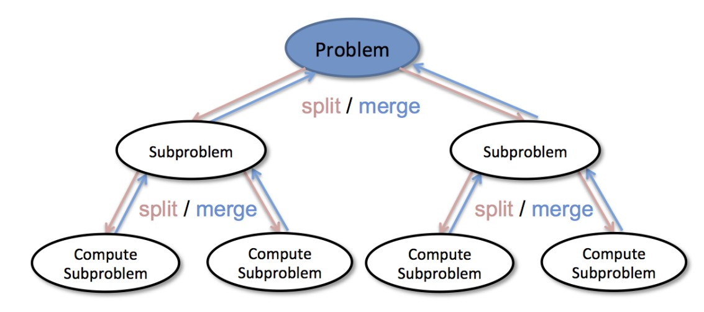

# 分治策略

## 分而治之

- 将问题分为若干更小规模的部分
- 通过解决每一个小规模部分问题，并将结果汇总得到原问题的解

  
---

## 递归算法与分治策略

- 递归三定律：
  - 基本结束条件，解决最小规模问题
  - 缩小规模，向基本结束条件演进
  - 调用自身来解决已缩小规模的相同问题
- 递归算法体现了分治策略
  - 问题解决依赖于若干缩小了规模的问题
  - 汇总得到原问题的解
- 分治策略应用相当广泛
  - 排序
  - 查找
  - 遍历
  - 求值

